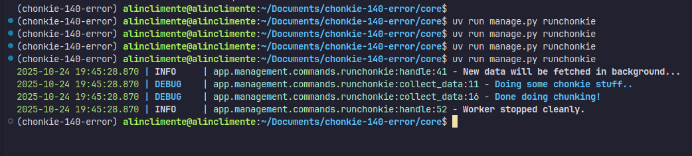

# chonkie-140-error

Something weird happens on version 1.4.0 (previous version works well)

- clone repo
- uv sync
- cd ./core 
- uv run manage.py makemigrations
- uv run manage.py migrate


In `core/app/management/commands/runchonkie.py` - there  is a django command which you can run with:
- uv run manage.py runchonkie

You can see the following output:



First 3 attempts are with the import chonkie. Something happens right on import `from chonkie import MarkdownChef` log `Doing some chonkie stuff..` is not shown. If you comment chonkie stuff you will see the logs as is up. Weird that there are no errors..


```py
from chonkie import MarkdownChef
from django.core.management.base import BaseCommand
from loguru import logger as log

stop_event = Event()

def collect_data():
    log.debug("Doing some chonkie stuff..")

    chef = MarkdownChef()
    log.debug(f"chef: {dir(chef)}")

    log.debug("Done doing chunking!")

```


Side note: I had to add these 2 packages on the fresh install: typing_extensions, requests (I think they should be added to chonkie requirements as well)

```
    from chonkie import MarkdownChef
  File "/home/alinclimente/Documents/chonkie-140-error/.venv/lib/python3.13/site-packages/chonkie/__init__.py", line 6, in <module>
    from .chef import (
    ...<4 lines>...
    )
  File "/home/alinclimente/Documents/chonkie-140-error/.venv/lib/python3.13/site-packages/chonkie/chef/__init__.py", line 4, in <module>
    from .markdown import MarkdownChef
  File "/home/alinclimente/Documents/chonkie-140-error/.venv/lib/python3.13/site-packages/chonkie/chef/markdown.py", line 7, in <module>
    from typing_extensions import List
ModuleNotFoundError: No module named 'typing_extensions'

```

```
  File "/home/alinclimente/Documents/chonkie-140-error/.venv/lib/python3.13/site-packages/chonkie/chunker/__init__.py", line 5, in <module>
    from .late import LateChunker
  File "/home/alinclimente/Documents/chonkie-140-error/.venv/lib/python3.13/site-packages/chonkie/chunker/late.py", line 9, in <module>
    from chonkie.embeddings.sentence_transformer import SentenceTransformerEmbeddings
  File "/home/alinclimente/Documents/chonkie-140-error/.venv/lib/python3.13/site-packages/chonkie/embeddings/__init__.py", line 3, in <module>
    from .auto import AutoEmbeddings
  File "/home/alinclimente/Documents/chonkie-140-error/.venv/lib/python3.13/site-packages/chonkie/embeddings/auto.py", line 7, in <module>
    from .registry import EmbeddingsRegistry
  File "/home/alinclimente/Documents/chonkie-140-error/.venv/lib/python3.13/site-packages/chonkie/embeddings/registry.py", line 7, in <module>
    from .cohere import CohereEmbeddings
  File "/home/alinclimente/Documents/chonkie-140-error/.venv/lib/python3.13/site-packages/chonkie/embeddings/cohere.py", line 9, in <module>
    import requests
ModuleNotFoundError: No module named 'requests'

```
